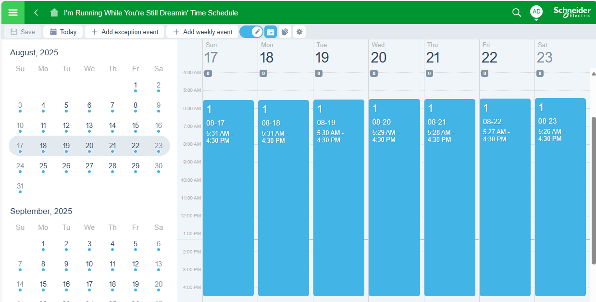
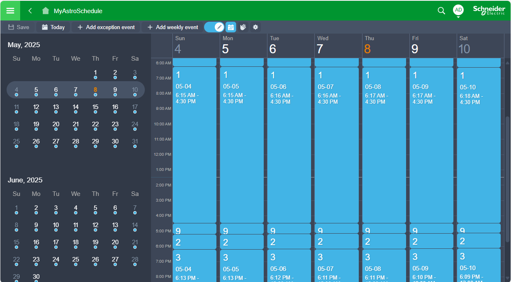

# AstroScheduler

**AstroScheduler** is a Python library for constructing EcoStruxure Building Operation (EBO) Multistate Time Schedule objects with daily astronomical (sunrise/sunset offset) events. Sunrise and sunset times are automatically calculated based on provided latitude and longitude using the `astral` library. Times are adjusted for timezones and daylight saving using `timezonefinder`.


## Features

- Generate EBO-compliant `<ObjectSet>` XML exports, ready for import into EBO.
- Automatically reference local daily sunrise and sunset times in a schedule based on geo coordinates and local timezone (including daylight savings).
- Simplify time schedule configuration using an Excel spreadsheet. Template provided.
- Create a combination of absolute time referenced and sunrise/sunset time referenced schedule events in the same schedule.
- Modular design for future object types (via `EBOXMLBuilder` base class).

---

## Example Usage

### Quickstart

```python
from astroscheduler.astroschedule import AstroSchedule

# Initialize the AstroSchedule class
schedule = AstroSchedule()

# Manually set the schedule configuration
schedule.schedule_name = "I'm Running While You're Still Dreamin' Time Schedule"
schedule.latitude = -27.467778 # latitude for Brisbane Australia CBD 
schedule.longitude = 153.028056 # longitude for Brisbane Australia CBD
schedule.default_value = 0 # default schedule value when no schedule events
schedule.ebo_version = "5.0.3.117"
# Manually add schedule event entries
schedule.add_entry(time_ref="SunriseOffset", hour="0", minute="-45", value="1") # start 45min before sunrise
schedule.add_entry(time_ref="Absolute", hour="16", minute="30", value=None) # end (return to default value) at 4:30 PM

print('This is what the config looks like:', schedule.config.to_dict())

# Write to EBO-compliant `<ObjectSet>` XML, ready for import into EBO
schedule.write_xml('schedule.xml')
```

Produces this time schedule, notice event entries are adjusted daily for sunrise/sunset times daily for the given lat/lon.



### Using Time Schedule Configuration Excel file

The AstroSchedulerConfig class is used to manage configuration data, including loading from an Excel spreadsheet, converting to a dictionary, and exporting to JSON.

#### Usage

A sample spreadsheet can be provided using `config.copy_sample_template('location_where_you_want_to_save_it.xlsx')`.

Two sheets are required, named `Entries` and `Configuration`.

#### Entries Sheet

| **Field**        | **Description**                                                                 | **Allowed Values**                                                                 | **Default Value** |
|------------------|---------------------------------------------------------------------------------|------------------------------------------------------------------------------------|-------------------|
| Description      | Optional human-friendly name of the event entry. Ignored by `AstroSchedule`.    | Any string                                                                         | N/A               |
| TimeReference    | Type of reference point for time calculation.                                   | `Absolute`, `SunriseOffset`, `SunsetOffset`                                        | `Absolute`        |
| Hour             | Hour offset from the reference time (or absolute hour of day if TimeReference is Absolute). | Integer (0–23). Can be negative for offsets before sunrise/sunset.                | 0                 |
| Minute           | Minute offset from the reference time (or minute of hour of day if TimeReference is Absolute).  | Integer (0–59). Can be negative in combination with Hour.                          | 0                 |
| Value            | The Value of the Time Schedule for this entry (or Null if restting to default). | Integer or empty or Null           | Null     |
| Comments         | Optional additional notes about the time reference or logic. Ignored by `AstroSchedule`.        | Any string                                                         | N/A          |

Example:


#### Configuration Sheet

| **Field Name**   | **Description**                                                  | **Allowed Values**                                      | **Default Value**       |
|------------------|------------------------------------------------------------------|---------------------------------------------------------|-------------------------|
| Latitude         | Geographic latitude of the location.                             | Decimal degrees between -90 and 90                      | None (must be provided) |
| Longitude        | Geographic longitude of the location.                            | Decimal degrees between -180 and 180                    | None (must be provided) |
| ScheduleType     | Type of schedule being generated.                                | Only `Multistate` currently supported. | `Multistate` |
| DefaultValue     | Default value when there is no schedule event entry.             | Integer            | 0 |
| ReferenceYear    | The year for which sunrise/sunset data is generated.             | 4-digit year (e.g., `2025`)                             | Current year (optional) |
| EBOVersion       | Version of the EcoStruxure Building Operation software.        | e.g. `"4.0.3"`, `"6.0.4.90"`                               | `"6.0.4.90"`               |
| ScheduleName     | Name/label assigned to the generated schedule.                   | Any string                                              | `"AstroSchedule"`      |

Example:


#### Example code

```python
import os
from astroscheduler.config import AstroSchedulerConfig

# Initialize the configuration class
config = AstroSchedulerConfig()

# Copy a sample Excel template to a desired location
template = "TimeScheduleConfig.xlsx"
config.copy_sample_template(template)

# … edit the template Excel file, save and close.

# Load configuration from the Excel file
config.from_spreadsheet(template)

# Access configuration attributes
print("Latitude:", config.latitude)
print("Longitude:", config.longitude)
print("Schedule Type:", config.schedule_type)
print("Entries:", config.entries)

# Optionally export time schedule configuration to a JSON file
output_json = os.path.join(os.path.dirname(__file__), "data/sample_output/config.json")
config.to_json(output_json)

# create astroschedule
schedule = AstroSchedule(config=config)

# Write to EBO-compliant `<ObjectSet>` XML, ready for import into EBO
schedule.write_xml('schedule.xml')

```

Produces this time schedule, notice event entries are adjusted daily for sunrise/sunset times daily for the given lat/lon.



#### Example Config

JSON File (`config.json`):

```
{
    "latitude": 37.7749,
    "longitude": -122.4194,
    "schedule_type": "Multistate",
    "default_value": 0,
    "reference_year": 2025,
    "ebo_version": "4.0.1",
    "entries": [
        {
            "Description": "WEE HOURS",
            "TimeReference": "Absolute",
            "Hour": 0,
            "Minute": 0,
            "Value": 7,
            "Comments": "TimeReference Absolute means the entry starts at the time of day Hour:Minute"
        },
        {
            "Description": "DAY",
            "TimeReference": "SunriseOffset",
            "Hour": 0,
            "Minute": 0,
            "Value": 1,
            "Comments": "TimeReference SunriseOffset means the entry starts at sunrise plus Hours:Minutes"
        },
    ]
}
```

### More

More examples in `scripts` folder.
